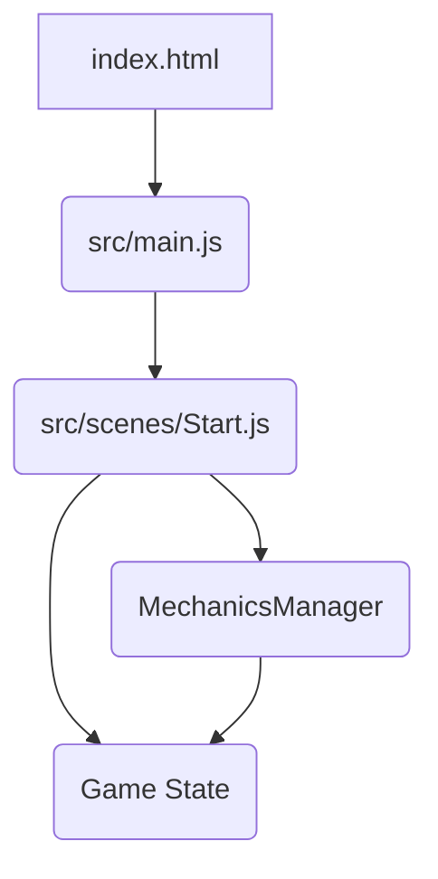

# Plan for Automating Game Mechanics Loop

This plan outlines the steps to implement an automated mechanics loop in the Phaser Idle RPG, focusing on resource generation and automated combat, with room for future expansion.

## 1. Define Game State and Data Structures

- **Goal:** Establish central data structures to hold the game's state, including resources, player stats, enemy information, and any other relevant data.
- **Details:**
  - Create a dedicated JavaScript file (e.g., `src/gameData.js`) to hold a global game state object.
  - This object will include properties for:
    - Resources (e.g., `gold`, `wood`, `stone`)
    - Player stats (e.g., `attack`, `defense`, `health`)
    - Current enemy information (e.g., `enemyHealth`, `enemyAttack`)
    - potentially other states like `isCombatActive`, `combatProgress`, etc.
- **Expandability:** Using a central object makes it easy to add new resources, stats, or other game-wide data points in the future.

## 2. Implement Resource Generation

- **Goal:** Create a system to automatically generate resources over time.
- **Details:**
  - In the `Start` scene or a new dedicated mechanics manager class, implement a timer or use Phaser's `update` method to periodically increase resource values in the game state object.
  - Define resource generation rates (e.g., gold per second). These could be simple variables initially and later be influenced by other game factors (upgrades, buildings, etc.).
  - Display the current resource amounts on the screen (requires UI elements, which can be added later).
- **Expandability:** New resource types can be added to the game state object, and their generation logic can be incorporated into the update mechanism. Different generation methods (e.g., per-second, per-click, based on other factors) can be added.

## 3. Implement Automated Combat

- **Goal:** Create a system for simulating combat automatically against enemies.
- **Details:**
  - Define enemy properties (health, attack, etc.) in the game state or a separate enemy data structure.
  - Implement combat logic that runs periodically (similar to resource generation).
  - In each combat tick, calculate damage dealt by the player to the enemy and vice versa based on their stats.
  - Update enemy and player health in the game state.
  - Determine combat outcomes (win, lose, retreat) based on health.
  - Implement rewards for winning combat (e.g., resources, experience).
- **Expandability:** New enemy types with different stats and abilities can be added. More complex combat mechanics (e.g., critical hits, abilities, status effects) can be introduced within the combat logic.

## 4. Create a Mechanics Manager (Optional but Recommended for Expansion)

- **Goal:** Encapsulate the resource generation and combat logic into a separate class for better organization and expandability.
- **Details:**
  - Create a new JavaScript file (e.g., `src/mechanicsManager.js`) and define a class (e.g., `MechanicsManager`).
  - Move the resource generation and combat logic into methods within this class (e.g., `updateResources()`, `runCombatTick()`).
  - Instantiate this class in the `Start` scene and call its update methods from the scene's `update` loop.
- **Expandability:** This manager class can easily incorporate new mechanics as the game grows. Each new mechanic can have its own method or set of methods within the manager, keeping the code organized.

## 5. Integrate with Phaser Scene

- **Goal:** Connect the implemented mechanics to the Phaser scene.
- **Details:**
  - In the `Start` scene's `create` method, initialize the game state and potentially the `MechanicsManager`.
  - In the `Start` scene's `update` method, call the functions or methods that update resources and run combat ticks. Ensure the timing is handled correctly (e.g., using `this.game.loop.delta` or Phaser timers).
  - (Future step) Update UI elements in the scene to display resource amounts, enemy health, combat status, etc.

## 6. Plan for Future Expansion

- **Goal:** Ensure the structure allows for easy addition of new features.
- **Details:**
  - **New Mechanics:** Add new methods to the `MechanicsManager` for features like building construction, upgrades, exploration, etc.
  - **UI Updates:** Create dedicated UI scenes or classes to manage the display of game data, reacting to changes in the game state.
  - **Data Persistence:** Implement saving and loading of the game state.
  - **Balancing:** Create configuration files or objects to easily adjust generation rates, combat stats, and other game balance parameters.

## Mermaid Diagram: High-Level Structure

This plan provides a roadmap for implementing the core idle RPG mechanics and sets up a structure that can be easily expanded with new features in the future.
