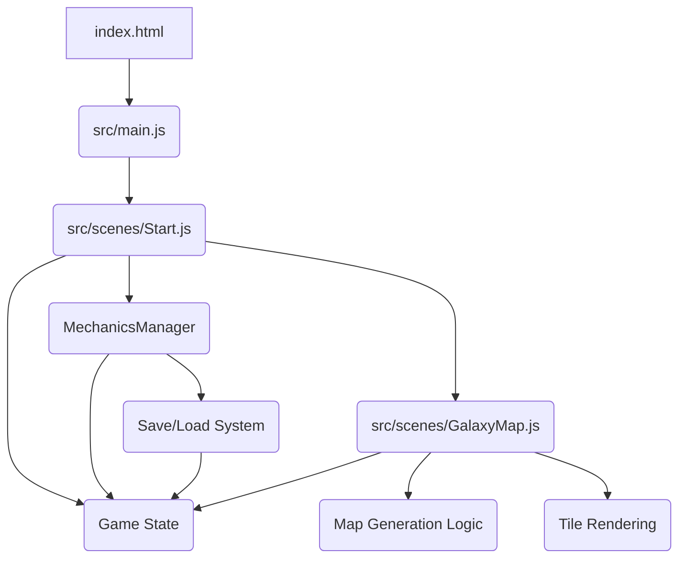

# Plan for Automating Game Mechanics Loop - Phase 2

This plan extends the initial mechanics plan, focusing on implementing a save file system and a new galaxy map exploration feature.

## 1. Implement Save File System

- **Goal:** Allow players to save and load their game progress, including resources, player stats, and other relevant game state data.
- **Details:**
    - **Data to Save:** The `gameState` object (from `src/gameData.js`) will be the primary data source for saving. This includes `resources`, `playerStats`, `currentEnemy`, `isCombatActive`, `combatProgress`, and any future additions to `gameState`.
    - **Saving Mechanism:**
        - Use `localStorage` for web-based persistence.
        - Convert the `gameState` object to a JSON string using `JSON.stringify()` before saving.
        - Store the JSON string under a specific key (e.g., `'idleRpgSave'`) in `localStorage`.
        - Implement a "Save Game" function that can be triggered manually (e.g., via a UI button) or automatically (e.g., periodically).
    - **Loading Mechanism:**
        - On game start or when a "Load Game" function is triggered, check if a save file exists in `localStorage`.
        - If a save file exists, retrieve the JSON string and parse it back into an object using `JSON.parse()`.
        - Update the `gameState` object with the loaded data.
        - Handle cases where no save data exists (e.g., start a new game).
    - **Integration:**
        - Create a new method in `MechanicsManager` (e.g., `saveGame()`, `loadGame()`) or a separate utility file for save/load logic.
        - Call `loadGame()` in the `Start` scene's `create` method to load previous progress.
        - Call `saveGame()` at appropriate points (e.g., before exiting, periodically in `update`).
- **Expandability:** The `gameState` object's structure allows for easy inclusion of new data points in the save file as the game evolves.

## 2. Implement Galaxy Map System

- **Goal:** Introduce a new "Galaxy Map" scene where players can explore a randomly generated tile-based map.
- **Details:**
    - **New Scene:** Create a new Phaser scene (e.g., `src/scenes/GalaxyMap.js`).
    - **Map Generation:**
        - Implement a procedural generation algorithm to create a tile-based map. This could be a simple grid-based system.
        - The map data will be stored as a 2D array or similar structure, where each element represents a tile type.
        - Consider using a seed for reproducible map generation (optional, but good for debugging/testing).
    - **Tile Rendering:**
        - Load provided PNG tile assets in the `preload` method of `GalaxyMap.js`.
        - Use Phaser's `Tilemap` and `Tileset` features to render the map.
        - Iterate through the generated map data and place the corresponding tile sprites.
    - **Player Movement/Interaction:**
        - Implement player movement on the map (e.g., click-to-move, arrow keys).
        - Define different tile types (e.g., empty space, asteroid fields, planets, enemy encounters).
        - Implement interaction logic when the player moves onto certain tiles (e.g., trigger combat, find resources, discover new locations).
    - **Integration:**
        - Add a way to transition from the `Start` scene to the `GalaxyMap` scene (e.g., a button).
        - The `GalaxyMap` scene will need access to `gameState` for player position, discovered areas, etc.
- **Expandability:**
    - New tile types and associated interactions can be easily added.
    - More complex generation algorithms (e.g., Perlin noise, cellular automata) can be introduced for varied map layouts.
    - Fog of war, pathfinding, and other exploration mechanics can be built upon this foundation.

## Mermaid Diagram: High-Level Structure (Phase 2 Additions)

This phase will significantly enhance the game's persistence and introduce a new layer of exploration, building upon the core mechanics established in Phase 1.